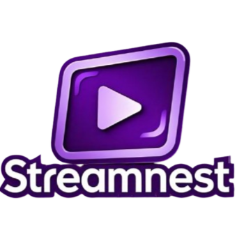

# StreamNest 

Welcome to **StreamNest**—my **first full-stack MERN project**. StreamNest is a fully functional video streaming platform where users can upload, view, and interact with video content. Built over the course of a month, StreamNest integrates modern web technologies to deliver a seamless user experience. I reworked on this project after some 6 months and changed the theme, fixed bugs, added premium features and much more.

## ✨Features

- **User Authentication**: Secure user login and registration using JSON Web Tokens (JWT).
- **Video Upload**: Upload videos with associated metadata like title, description, and thumbnail images.
- **Video Streaming**: Stream videos directly within the application with customizable quality settings.
- **Comment System**: Users can add, edit, and delete comments on videos.
- **Like & Subscribe**: Users can like videos and subscribe to channels.
- **Watch History**: Automatically track and display the user's watch history.
- **Playlist Management**: Create, edit, and delete playlists for organizing videos.
- **Premium Features**: Have exclusive videos and playlists to generate revenue.

## Tech Stack

### Frontend
- **React.js**: A powerful library for building dynamic user interfaces.
- **Tailwind CSS**: Utility-first CSS framework for rapid UI development.

### Backend
- **Node.js**: JavaScript runtime for executing server-side code.
- **Express.js**: A minimal and flexible Node.js web application framework.
- **MongoDB**: A NoSQL database for storing user data, videos, comments, and more.
- **Mongoose**: An ODM (Object Data Modeling) library for MongoDB.
- **JSON Web Tokens (JWT)**: For secure user authentication.

### Cloud Services
- **Cloudinary**: Handles image and video uploads, storage, and transformations.

## Usage

- **Register/Login**: Create a new account or log in with your credentials.
- **Upload Video**: Click on the "Upload" button, fill in the necessary details, and submit.
- **Explore**: Browse videos, like and comment, or subscribe to your favorite channels.
- **Manage Playlists**: Create or manage playlists to organize your videos.
- **Manage Posts**: Create or manage community posts.

## Folder Structure

```bash
StreamNest/
├── Backend/
│   ├── node_modules/
│   ├── public/
│   │   └── temp/
│   └── src/
│       ├── controllers/
│       ├── db/
│       ├── middlewares/
│       ├── models/
│       ├── routes/
│       ├── utils/
│       ├── db.js
│       └── index.js
├── Frontend/
│   ├── node_modules/
│   └── src/
│       ├── components/
│       │   ├── Account/
│       │   ├── AppComponents/
│       │   ├── assets/
│       │   ├── Playlist/
│       │   ├── Post/
│       │   ├── Subscription/
│       │   ├── Utils/
│       │   ├── Video/
│       ├── App.jsx
│       ├── index.css
│       └── main.jsx
├── README.md
```

## Challenges & Learnings

Building **StreamNest** was both challenging and rewarding. Some key learnings include:

- **Authentication**: Implementing secure authentication using JWT was a significant learning curve.
- **File Handling**: Integrating Cloudinary for handling large video files and generating optimized thumbnails was both interesting and challenging.
- **Responsive Design**: Tailwind CSS proved to be an excellent choice for building responsive interfaces quickly.
- **State Management**: Managing complex states in React, especially with asynchronous data, required careful planning and effective use of hooks.

## Todo todo
- Other videos from this channel (copy channel vids to get top 5 vids, get limited data, display)
- Error handling
    - Replace ApiError with ApiResponse
    - Replace try-catch with individual then-catch
    - Display error data


## License

This project is licensed under the MIT License - see the [LICENSE](./LICENSE) file for details.

Thank you for checking out **StreamNest**! I hope you enjoy using it as much as I enjoyed building it. 🎉

 